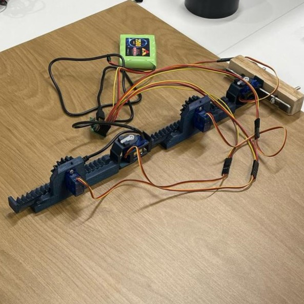

<div align="center">
  <h1>IK Servo Arm</h1>
  <p>A real-time inverse kinematics system for a 4-DOF robotic arm using servo motors and a visual control interface</p>

  <!-- Badges -->
  <p>
    
    
    <a href="https://github.com/orishlach/ik-servo-arm/blob/main/LICENSE">
      
    </a>
  </p>
</div>

  
<!-- Links -->
  <h4>
    <a href="#preview">View Demo</a>
    <span> · </span>
    <a href="#setup--installation">Installation</a>
    <span> · </span>
    <a href="docs/theoretical_background.md" target="_blank">Theoretical Background</a>
  </h4>
  <p>
    <small align="justify">
      Built with 🤍 by 
      <a href="https://github.com/orishlach">Or Ishlach</a> and 
      <a href="https://github.com/Ran-Keren">Ran Keren</a>, under the supervision of 
      <a href="https://github.com/Roipo">Roi Poranne</a>
    </small>
  </p>
  <small align="justify">🎓 A final-year capstone project submitted as part of the requirements for a degree in Computer Science, 2024–2025
  </small>
</div><br/><br/>
 

## About the Project


The inspiration behind this project was to develop a robotic hand that dynamically adapts to the structure and movement of a human hand.  

This mismatch posed a core challenge:  
**How can we make a robotic hand accurately mimic a human hand when their joint structures are fundamentally different?**

Our solution involved developing a dynamic software system that controls a robotic arm with both revolute and prismatic joints.  
The system uses inverse kinematics (IK) and servo control to translate abstract hand poses into accurate physical movement —  
without the need for recalibration or one-to-one joint mapping.


## Setup & Installation


1. **Clone the Repository**  
   ```bash
   git clone https://github.com/orishlach/ik-servo-arm
   cd ik-servo-arm
   ```

2. **Install Dependencies**

Make sure you have Python installed. Then install required packages:

```bash
pip install -r requirements.txt
```

3. **Connect Hardware (Optional)**

If you are using a Pololu Maestro:

- Connect the device to your computer.
- Set the correct port and baud rate in `main.py` (e.g., `COM3` or `/dev/ttyACM0`).

If no hardware is connected, the simulation will run without sending servo commands.

4. **Run the Application**

```bash
python main.py
```

5. **Usage**

- **Left Subplot**: Click to set a new IK target for the robotic arm.
- **Right Subplot**: Use sliders to adjust joint angles, prismatic extensions, and IK weights.
- The system automatically updates the simulation and optionally sends commands to connected servos.


## Preview 

<a href="https://www.youtube.com/shorts/3k47y3o17Gk" target="_blank">
  
</a>

> Click the image to see a short video demonstration of the physical robotic arm controlled via the GUI.  

